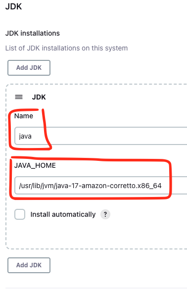
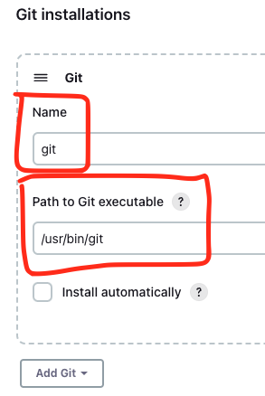
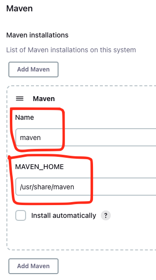
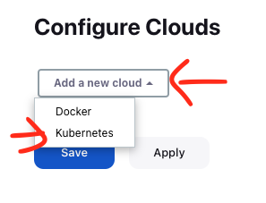
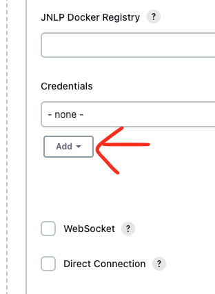
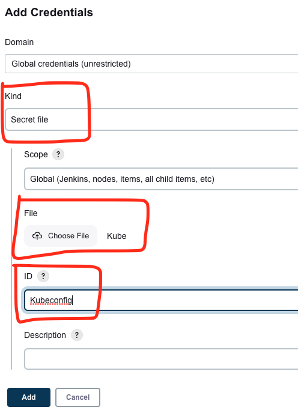
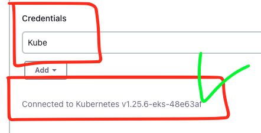

# Install Jenkins Using Terraform

This Terraform script creates/installs the resources below.

- Jenkins EC2 Server
- Jenkins' security group
- The user `jenkis` with `sudo` permissions
- Terraform
- Ansible
- Maven
- Git
- Java11
- Terraform
- AWS CLI
- Kubectl
- EKSCTL
- Docker
- Jenkins

## 1. Initialize the directory

```terraform
terraform init
```

## 2. Apply the changes

```terraform
terraform apply
```

Type `yes`

## 3. Check the execution result

```shell
null_resource.ansible (remote-exec): =============== PIP3 ===============
null_resource.ansible (remote-exec): pip 20.2.2 from /usr/lib/python3.7/site-packages/pip (python 3.7)

null_resource.ansible (remote-exec): =============== Ansible ===============
null_resource.ansible (remote-exec): [DEPRECATION WARNING]: Ansible will require Python 3.8 or newer on the
null_resource.ansible (remote-exec): controller starting with Ansible 2.12. Current version: 3.7.16 (default, Dec 15
null_resource.ansible (remote-exec):  2022, 23:24:54) [GCC 7.3.1 20180712 (Red Hat 7.3.1-15)]. This feature will be
null_resource.ansible (remote-exec): removed from ansible-core in version 2.12. Deprecation warnings can be disabled
null_resource.ansible (remote-exec):  by setting deprecation_warnings=False in ansible.cfg.
null_resource.ansible (remote-exec): ansible [core 2.11.12]
null_resource.ansible (remote-exec):   config file = None
null_resource.ansible (remote-exec):   configured module search path = ['/home/ec2-user/.ansible/plugins/modules', '/usr/share/ansible/plugins/modules']
null_resource.ansible (remote-exec):   ansible python module location = /usr/local/lib/python3.7/site-packages/ansible
null_resource.ansible (remote-exec):   ansible collection location = /home/ec2-user/.ansible/collections:/usr/share/ansible/collections
null_resource.ansible (remote-exec):   executable location = /usr/local/bin/ansible
null_resource.ansible (remote-exec):   python version = 3.7.16 (default, Dec 15 2022, 23:24:54) [GCC 7.3.1 20180712 (Red Hat 7.3.1-15)]
null_resource.ansible (remote-exec):   jinja version = 3.1.2
null_resource.ansible (remote-exec):   libyaml = True

null_resource.ansible (remote-exec): =============== Maven ===============
null_resource.ansible (remote-exec): Apache Maven 3.0.5 (Red Hat 3.0.5-17)
null_resource.ansible (remote-exec): Maven home: /usr/share/maven
null_resource.ansible (remote-exec): Java version: 17.0.6, vendor: Amazon.com Inc.
null_resource.ansible (remote-exec): Java home: /usr/lib/jvm/java-17-amazon-corretto.x86_64
null_resource.ansible (remote-exec): Default locale: en_US, platform encoding: UTF-8
null_resource.ansible (remote-exec): OS name: "linux", version: "5.10.167-147.601.amzn2.x86_64", arch: "amd64", family: "unix"

null_resource.ansible (remote-exec): =============== Git ===============
null_resource.ansible (remote-exec): git version 2.39.2

null_resource.ansible (remote-exec): =============== Java ===============
null_resource.ansible (remote-exec): openjdk 17.0.6 2023-01-17 LTS
null_resource.ansible (remote-exec): OpenJDK Runtime Environment Corretto-17.0.6.10.1 (build 17.0.6+10-LTS)
null_resource.ansible (remote-exec): OpenJDK 64-Bit Server VM Corretto-17.0.6.10.1 (build 17.0.6+10-LTS, mixed mode, sharing)

null_resource.ansible (remote-exec): =============== Terraform ===============
null_resource.ansible (remote-exec): Terraform v1.4.2
null_resource.ansible (remote-exec): on linux_amd64

null_resource.ansible (remote-exec): =============== AWSCLI ===============
null_resource.ansible: Still creating... [9m10s elapsed]
null_resource.ansible (remote-exec): aws-cli/2.11.4 Python/3.11.2 Linux/5.10.167-147.601.amzn2.x86_64 exe/x86_64.amzn.2 prompt/off
null_resource.ansible (remote-exec): =============== Kubectl ===============
null_resource.ansible (remote-exec): WARNING: This version information is deprecated and will be replaced with the output from kubectl version --short.  Use --output=yaml|json to get the full version.
null_resource.ansible (remote-exec): Client Version: version.Info{Major:"1", Minor:"25", GitVersion:"v1.25.0", GitCommit:"a866cbe2e5bbaa01cfd5e969aa3e033f3282a8a2", GitTreeState:"clean", BuildDate:"2022-08-23T17:44:59Z", GoVersion:"go1.19", Compiler:"gc", Platform:"linux/amd64"}
null_resource.ansible (remote-exec): Kustomize Version: v4.5.7

null_resource.ansible (remote-exec): =============== EKSCTL ===============
null_resource.ansible (remote-exec): 0.134.0

null_resource.ansible (remote-exec): =============== Docker Group ===============
null_resource.ansible (remote-exec): docker:x:992:ec2-user,jenkins

null_resource.ansible (remote-exec): =============== Jenkins Password ===============
null_resource.ansible (remote-exec): 04c4b1ae96e04ac19ce098591726e52d

null_resource.ansible (remote-exec): Added new context arn:aws:eks:us-east-1:012345678901:cluster/test-eks to /home/ec2-user/.kube/config
null_resource.ansible: Creation complete after 9m14s [id=2947386559599772056]

Apply complete! Resources: 3 added, 0 changed, 0 destroyed.

Outputs:

website_url = "http://ec2-XXX-XXX-XXX-XXX.compute-1.amazonaws.com:8080"
```

## 4. Finish the Jenkins installation using your browser

In the execution result, find the code below.

```shell
Outputs:

website_url = "http://ec2-XXX-XXX-XXX-XXX.compute-1.amazonaws.com:8080"
```

Open this URL `http://ec2-XXX-XXX-XXX-XXX.compute-1.amazonaws.com:8080` in your browser.

In the execution result, find the code below. This is the password to unlock Jenkins.

```shell
=============== Jenkins Password ===============
c403ff75298740de9d13006e2ee4ac1b
````

## 5. Add the variables

After you unlock and install Jenkins using the password you found in the execution result, go to `Dashboard >> Manage Jenkins >> Global Tool Configuration` and add the variables below.

### Java

In the execution result, find the code below.

```shell
null_resource.ansible (remote-exec): =============== Maven ===============
null_resource.ansible (remote-exec): Apache Maven 3.0.5 (Red Hat 3.0.5-17)
null_resource.ansible (remote-exec): Maven home: /usr/share/maven
null_resource.ansible (remote-exec): Java version: 17.0.6, vendor: Amazon.com Inc.
null_resource.ansible (remote-exec): Java home: /usr/lib/jvm/java-17-amazon-corretto.x86_64
null_resource.ansible (remote-exec): Default locale: en_US, platform encoding: UTF-8
null_resource.ansible (remote-exec): OS name: "linux", version: "5.10.167-147.601.amzn2.x86_64", arch: "amd64", family: "unix"
```

Copy the line `/usr/lib/jvm/java-17-amazon-corretto.x86_64`



### Git

Execute the code below.

```shell
$ which git
/usr/bin/git
```

Copy the line `/usr/bin/git`



### Maven

In the execution result, find the code below.

```shell
null_resource.ansible (remote-exec): =============== Maven ===============
null_resource.ansible (remote-exec): Apache Maven 3.0.5 (Red Hat 3.0.5-17)
null_resource.ansible (remote-exec): Maven home: /usr/share/maven
null_resource.ansible (remote-exec): Java version: 17.0.6, vendor: Amazon.com Inc.
null_resource.ansible (remote-exec): Java home: /usr/lib/jvm/java-17-amazon-corretto.x86_64
null_resource.ansible (remote-exec): Default locale: en_US, platform encoding: UTF-8
null_resource.ansible (remote-exec): OS name: "linux", version: "5.10.167-147.601.amzn2.x86_64", arch: "amd64", family: "unix"
```

Copy the line `/usr/share/maven`



## 6. Add the plugins

After you set all the variables, go to `Dashboard >> Manage Jenkins >> Manage Plugins` and the plugins below.

- Docker
- Docker Pipeline
- Kubernetes
- Kubernetes Credentials
- Kubernetes Client API
- GitHub Integration

## 7. Add the Kubernetes context

To add the Kubernetes context, SHH the Jenkins server and run. You can find the URL in the 

```shell
cat .kube/config
```

The result will something lke this.

```yaml
apiVersion: v1
clusters:
- cluster:
    certificate-authority-data: LS0tLS1CRUQotLS0tLKJBHGVDRVJUSUZJQ0FURS0tLS0tCg==...
    server: https://XXXXXXXXXXXXXXXXXXXXXXXXXXXXX.gr7.us-east-1.eks.amazonaws.com
  name: arn:aws:eks:us-east-1:012345678901:cluster/test-eks
contexts:
- context:
    cluster: arn:aws:eks:us-east-1:012345678901:cluster/test-eks
    user: arn:aws:eks:us-east-1:012345678901:cluster/test-eks
  name: arn:aws:eks:us-east-1:012345678901:cluster/test-eks
current-context: arn:aws:eks:us-east-1:012345678901:cluster/test-eks
kind: Config
preferences: {}
users:
- name: arn:aws:eks:us-east-1:012345678901:cluster/test-eks
  user:
    exec:
      apiVersion: client.authentication.k8s.io/v1beta1
      args:
      - --region
      - us-east-1
      - eks
      - get-token
      - --cluster-name
      - test-eks
      - --output
      - json
      command: aws
```

Create a file in your local with this context.

Go to `Dashboard >> Manage Jenkins >> Manage Nodes and Clouds >> Configure Clouds >>`.

Add a new cloud and select Kubernetes. 



Expand `Kubernetes Cloud Details`.

Add a new Kubernetes credentials.
 


Change the `Kind` to `Secret file`.

Select the file you saved in your local with the context you gathered after SSH the server and run the `cat` command.

Add the `ID` `Kubeconfig`.

Add this configuration.



Select the `Credentials` `Kube`

Test the connection.

You should see something like this.

```shell
Connected to Kubernetes v1.25.6-eks-48e63af
```



Save these settings.

## 8. Create Pipelines

You can get the pipelines codes on the [Using Jenkins to deploy Spring Boot Applications into EKS](https://github.com/ricardorqr/jenkins-github-eks) project.

